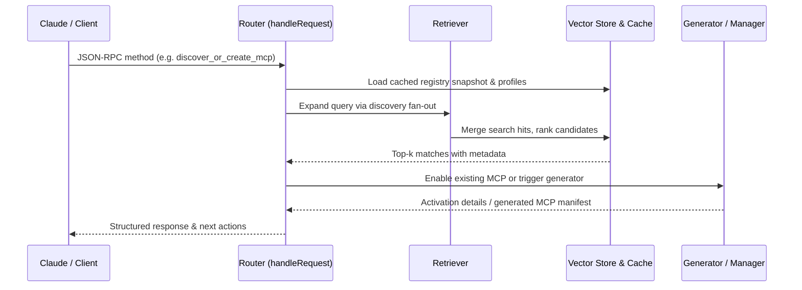

# Router, Retriever & Vector Store Overview

This guide explains how WTF-MCP-Manager routes user questions across its discovery services, indexes metadata, and keeps the vector-backed retriever fresh in day-to-day operations. It also covers Docker Compose deployment patterns and operational runbooks for keeping the stack healthy.

## Core Components

| Component | Responsibility | Implementation notes |
| --- | --- | --- |
| **Vector store** | Holds normalized metadata for known MCP servers, discovered APIs, and user-specific resources. It is hydrated from the built-in registry, remote registry dumps, and discovery results so the router can score candidate actions. | The server merges remote registry text with the curated registry in `MCPRegistry`, giving every entry a friendly name, description, and categories before it is embedded.【F:lib/mcp-server.js†L200-L233】【F:lib/registry.js†L1-L93】
| **Retriever** | Produces the ranked context set that informs routing. Queries fan out across local config, the discovery cache, and live API lookups before results are combined and scored. | `APIDiscoveryService` fans out to the local API database, public registries, npm, GitHub, and a web search helper, caching responses for thirty minutes to avoid repeated calls.【F:lib/discovery/api-discovery.js†L10-L199】
| **Router** | Chooses the follow-up action to satisfy a query (enable an existing MCP, generate a new one, or compose workflows). It evaluates retriever hits alongside project configuration to decide next steps. | `WTFMCPManagerServer.handleRequest` wires tool calls such as `fetch_mcps`, `discover_or_create_mcp`, and `compose_workflow`, delegating to the manager, discovery service, and generator to fulfil each request.【F:lib/mcp-server.js†L303-L663】

## Query Handling Flow



**Lifecycle steps**

1. **Request ingestion** – `wtf-mcp-manager serve` forwards every JSON-RPC call to `handleRequest`, which normalises parameters and decides which sub-system to call.【F:bin/wtf-mcp.js†L232-L255】【F:lib/mcp-server.js†L303-L360】
2. **Context hydration** – The router loads project-level configuration managed by `MCPManager`, so enabled MCPs and stored credentials are considered during routing.【F:lib/manager.js†L11-L166】
3. **Retrieval** – `APIDiscoveryService` issues concurrent searches across the local API database, registry dumps, npm, GitHub, and the web; hits are cached in-memory (the vector store) and ranked for relevance.【F:lib/discovery/api-discovery.js†L25-L199】
4. **Decision** – Depending on the ranked output, the router will either enable an existing MCP, suggest alternatives, or invoke the dynamic generator to produce new code from an OpenAPI/FastAPI description.【F:lib/mcp-server.js†L524-L626】
5. **Response** – Workflow assembly, testing hooks, or metadata about generated artefacts are returned to the client to guide the next conversational turn.【F:lib/mcp-server.js†L632-L680】

## Docker Compose Deployment

Use Docker Compose to bundle the manager, a vector database, and optional monitoring. The snippet below assumes the repository root is the build context:

```yaml
version: '3.9'
services:
  manager:
    build: .
    command: ['npx', 'wtf-mcp-manager', 'serve']
    env_file: .env
    volumes:
      - type: bind
        source: ./data
        target: /app/.claude
      - type: bind
        source: ./metadata
        target: /app/metadata
    depends_on:
      vectorstore:
        condition: service_healthy
    healthcheck:
      test: ['CMD', 'node', '-e', 'process.exit(0)']
      interval: 30s
      timeout: 5s
      retries: 3

  vectorstore:
    image: ghcr.io/chroma-core/chroma:latest
    environment:
      - IS_PERSISTENT=TRUE
    volumes:
      - type: bind
        source: ./vectorstore
        target: /chroma/.chroma
    healthcheck:
      test: ['CMD', 'curl', '-f', 'http://localhost:8000/api/v1/heartbeat']
      interval: 30s
      timeout: 5s
      retries: 5

  redis:
    image: redis:7-alpine
    command: ['redis-server', '--save', '', '--appendonly', 'no']
    ports:
      - '6379:6379'
    healthcheck:
      test: ['CMD', 'redis-cli', 'ping']
      interval: 30s
      timeout: 5s
      retries: 5
```

1. Copy the sample into `docker-compose.yml` and create the bind-mounted directories (`data/`, `metadata/`, and `vectorstore/`).
2. Populate `.env` with secrets and API keys before bootstrapping the stack (see the table below).
3. Start the stack with `docker compose up -d --build` and watch logs using `docker compose logs -f manager`.

### Environment variables

| Variable | Purpose | Notes |
| --- | --- | --- |
| `ANTHROPIC_API_KEY` | Lets the generator call Claude to scaffold new MCP servers. | Required when invoking `discover_or_create_mcp` with auto-generation.【F:lib/mcp-server.js†L524-L626】
| `OPENAI_API_KEY` | Optional secondary model for embedding/vectorisation. | Used by retrieval helpers when configured.【F:lib/discovery/api-discovery.js†L25-L46】
| `FIRECRAWL_API_KEY` | Enables the Firecrawl MCP from the curated registry.【F:lib/registry.js†L17-L40】
| `BRAVE_API_KEY` | Powers the Brave Search MCP entry.【F:lib/registry.js†L9-L32】
| `GITHUB_TOKEN` | Required when enabling GitHub MCP or for GitHub discovery quotas.【F:lib/registry.js†L41-L69】【F:lib/discovery/api-discovery.js†L140-L167】
| `SUPABASE_URL`, `SUPABASE_SERVICE_ROLE_KEY` | Supabase MCP credentials.【F:lib/registry.js†L1-L24】
| `AWS_ACCESS_KEY_ID`, `AWS_SECRET_ACCESS_KEY` | AWS MCP access keys.【F:lib/registry.js†L69-L93】

Mount the `.env` file into other services as needed if they should share API keys (for example, embedding jobs that run inside the vector store container).

## Adding New Metadata Sources Without Code Changes

1. **Import fresh registry dumps** – Call the `fetch_mcps` tool with `force: true` (via Claude or `docker compose exec manager node lib/mcp-server.js`) to refresh the canonical registry text. The router will merge the new snapshot with curated metadata on the next request.【F:lib/mcp-server.js†L200-L356】
2. **Seed project-specific manifests** – Place JSON or YAML descriptors under `./metadata/` (mounted at `/app/metadata` in the Compose file). On restart, load them into the vector store using the Chroma HTTP API or CLI so the retriever can surface them alongside global entries.
3. **Upload OpenAPI/FastAPI specs** – Drop specs into `data/dynamic-specs/` and issue a `discover_or_create_mcp` call with `autoCreate: true`. The generator persists new MCP manifests under `.claude/dynamic-mcps/`, immediately expanding the router’s metadata universe without editing application code.【F:lib/dynamic/mcp-generator.js†L12-L36】【F:lib/mcp-server.js†L524-L626】

Because the router always reloads project configuration before serving a request, any metadata introduced through the three paths above becomes searchable after a quick re-index (restart the `manager` container or call `fetch_mcps` with `force`).

## Maintenance Playbook

| Task | Cadence | Procedure |
| --- | --- | --- |
| **Re-index vector store** | Weekly or after large metadata imports | Stop the `manager` service, purge stale embeddings in `vectorstore/`, then restart `vectorstore` followed by `manager` so the retriever repopulates caches during warm-up. |
| **Monitor health** | Continuous | Attach to `docker compose logs -f manager vectorstore redis` and watch for discovery throttling, generator errors, or registry fetch failures. Add alerts for non-zero exit codes on health checks. |
| **Performance tuning** | Monthly | Review cache TTLs, adjust vector dimensionality/embedding provider, and scale Redis memory. Within the app, fine-tune discovery concurrency or ranking thresholds in `APIDiscoveryService` if latency or cost spikes appear.【F:lib/discovery/api-discovery.js†L10-L46】 |

For day-to-day operations, keep backups of the `data/` and `vectorstore/` directories, rotate API keys stored in `.env`, and regularly verify `docker compose ps` shows healthy services before exposing the MCP router to production assistants.
