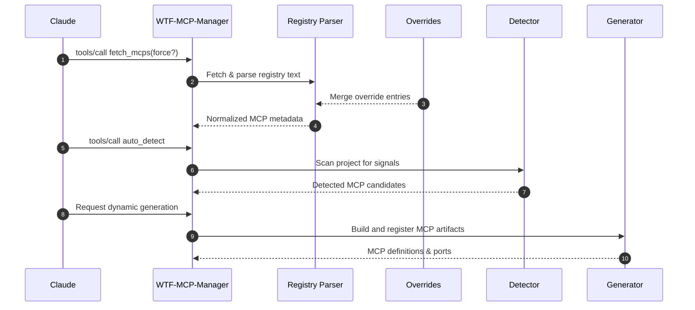
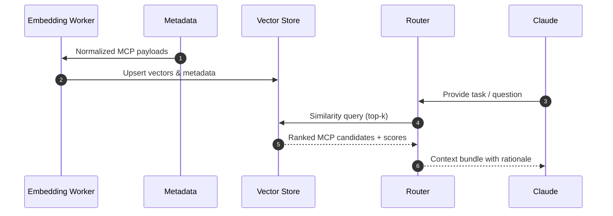
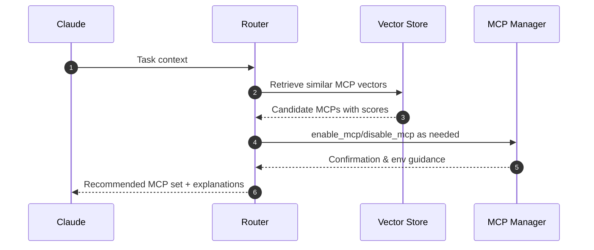

# Context Router Architecture

The WTF-MCP-Manager context router ties together metadata ingestion, vector retrieval, and dynamic routing so Claude can decide which MCPs to activate for any conversation. This document provides visual flows and operational guidance for each stage of the pipeline.

## High-Level Topology

```mermaid
flowchart LR
    subgraph Discovery & Generation
        A[Official MCP Registry] -->|fetch_mcps| B[Registry Parser]
        A2[Registry Overrides<br/>(.claude/registry-overrides.json)] --> B
        A3[Local Project Scan<br/>(AutoDetector)] --> C[Project Signals]
        A4[Dynamic MCP Generator] --> D[Generated MCP Artifacts]
    end

    subgraph Vector Intelligence
        B --> E[Metadata Normalizer]
        C --> E
        D --> E
        E --> F[Embedding Worker]
        F --> G[(Vector Store)]
    end

    subgraph Routing Runtime
        G --> H[Context Router]
        C --> H
        H --> I[Claude Conversation]
        H --> J[MCP Enable/Disable]
    end
```

## Ingestion Flow

1. **Registry retrieval** – `fetch_mcps` downloads the public registry text and merges it with the built-in catalog so the router has a canonical list of known MCPs.【F:lib/mcp-server.js†L120-L188】
2. **Override hydration** – Local JSON overrides in `.claude/registry-overrides.json` or any path listed in `WTF_MCP_REGISTRY_OVERRIDES` are merged into the registry at startup, allowing you to extend metadata without editing the codebase.【F:lib/registry.js†L1-L121】
3. **Project scanning** – `AutoDetector` inspects the repo to surface MCP hints derived from files, configuration, and heuristics.【F:lib/mcp-server.js†L366-L377】
4. **Dynamic generation** – The generator stores on-the-fly MCP builds in `.claude/dynamic-mcps` so they can be indexed alongside static servers.【F:lib/dynamic/mcp-generator.js†L10-L45】



## Vector Retrieval Flow

After ingestion, metadata is embedded for semantic search so the router can pick the most relevant MCPs for a conversation.



### Implementation Notes

- **Batching** – Process registry entries in batches (100–200) to avoid embedding rate limits when refreshing the catalogue.
- **Metadata payload** – Include `id`, `description`, `categories`, required env vars, and project heuristics for best recall.
- **Storage options** – Start with a lightweight SQLite + `sqlite-vector` bundle for local workflows, then graduate to Postgres/pgvector or managed vector stores if latency or scale require it.

## Context Routing Flow



### Routing Heuristics

1. **Vector similarity** – Start with cosine similarity across embeddings to prune the candidate list.
2. **Constraint filtering** – Drop MCPs that are missing required environment variables or conflict with the active profile before surfacing them.【F:lib/manager.js†L128-L205】
3. **Conversation memory** – Prefer MCPs already active in the current `.claude` profile unless the new task demands replacements.
4. **Human-in-the-loop** – Always return rationale tokens so Claude can explain why a tool is suggested and ask the user for confirmation before enabling it.

## Metadata Source Playbook

1. Create `.claude/registry-overrides.json` (or point `WTF_MCP_REGISTRY_OVERRIDES` at a JSON file). Each entry should map an MCP id to its metadata payload:

   ```json
   {
     "custom-weather": {
       "name": "Custom Weather",
       "package": "@acme/mcp-weather",
       "command": "npx",
       "args": ["-y", "@acme/mcp-weather"],
       "requiredEnv": ["ACME_WEATHER_TOKEN"],
       "description": "Internal weather API"
     }
   }
   ```

2. Restart the manager or re-run the CLI command. The override is merged automatically, so `list` and `enable` now understand the new MCP without touching the source code.【F:lib/registry.js†L43-L121】
3. Store secrets in `.claude/.env` or your secret manager; the router only needs identifiers and connection metadata in the override file.【F:lib/manager.js†L128-L213】

## Operational Tasks

- **Re-index metadata** – Run `wtf-mcp-manager fetch --force` followed by your embedding job to rebuild vectors after large registry changes.【F:lib/mcp-server.js†L120-L188】
- **Monitor retrieval quality** – Track hit rates for `tools/list` recommendations and set alerts when similarity scores drop below historical baselines.
- **Performance tuning** – Cache registry fetches (30-minute TTL) and warm the vector store with recent conversations to minimize cold-start latency.【F:lib/mcp-server.js†L24-L33】【F:lib/mcp-server.js†L120-L188】

## Further Reading

- `README.md` – Deployment, Docker Compose, and maintenance checklists.
- `docs/mcp-complete-implementation-guide.md` – End-to-end MCP implementation patterns.
